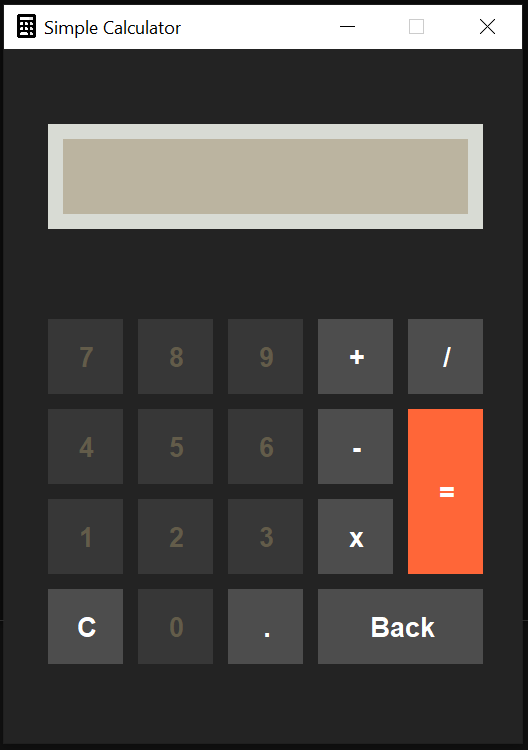

# Simple Calculator

This is a simple calculator application built using Java and Swing. It provides basic arithmetic operations such as addition, subtraction, multiplication, and division. The interface is designed to be user-friendly with an aesthetic appearance.

## Features

- **Basic Arithmetic Operations**: Perform addition, subtraction, multiplication, and division.
- **Clear and Backspace Functions**: Clear the input field or remove the last character.
- **Decimal Point**: Support for decimal point calculations.
- **Error Handling**: Inform users about invalid inputs or division by zero.

## Screenshot



## Getting Started

### Prerequisites

- JDK 8 or higher installed on your machine.
- An IDE or text editor (such as IntelliJ IDEA, Eclipse, or VS Code) to run and modify the code.
- Basic understanding of Java and Swing.

### Installation

1. **Clone the Repository**: Clone this repository to your local machine using the following command:

   ```bash
   git clone https://github.com/asifahamed11/Java-Swing-Calculator.git
   ```

2. **Navigate to the Project Directory**:

   ```bash
   cd simple-calculator
   ```

3. **Compile and Run the Application**: Open the project in your preferred IDE and run the `App` class.

   Alternatively, you can compile and run the application using the command line:

   ```bash
   javac App.java
   java App
   ```

## Code Explanation

The main components of the code are:

- **Class Declaration**: The `App` class extends `JFrame` and implements `ActionListener`.
- **User Interface Setup**: The constructor `App()` sets up the user interface, including buttons and the text field.
- **Event Handling**: The `actionPerformed` method handles the button click events to perform arithmetic operations and other functionalities.
- **Error Handling**: The `try-catch` blocks handle potential errors like invalid inputs and division by zero.

## How to Use

1. **Launching the Application**: Run the `App` class to launch the calculator.
2. **Input Numbers and Operations**: Click on the buttons to input numbers and select operations.
3. **Get Results**: Press the `=` button to get the result of the operation.
4. **Clear or Backspace**: Use the `C` button to clear the input or the `Back` button to delete the last character.

## Contributing

If you want to contribute to this project, follow these steps:

1. Fork the repository.
2. Create a new branch (`git checkout -b feature-branch`).
3. Make your changes and commit them (`git commit -m 'Add some feature'`).
4. Push to the branch (`git push origin feature-branch`).
5. Open a pull request.

## License

This project is licensed under the MIT License - see the [LICENSE](LICENSE) file for details.

## Acknowledgements

- Inspired by the need for a simple and functional calculator.
- Special thanks to the Java and Swing documentation.
